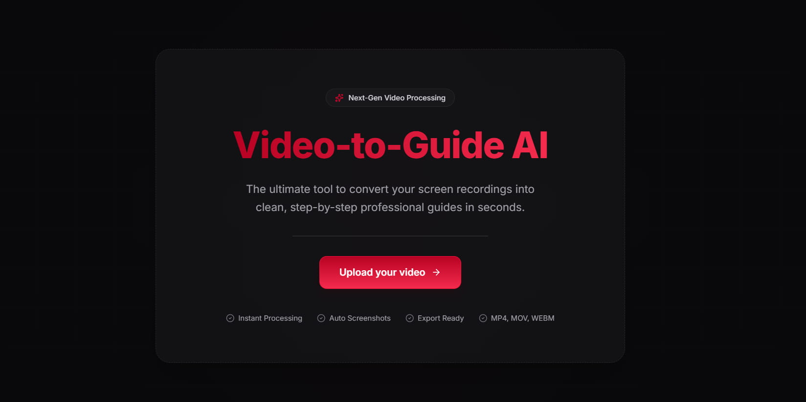
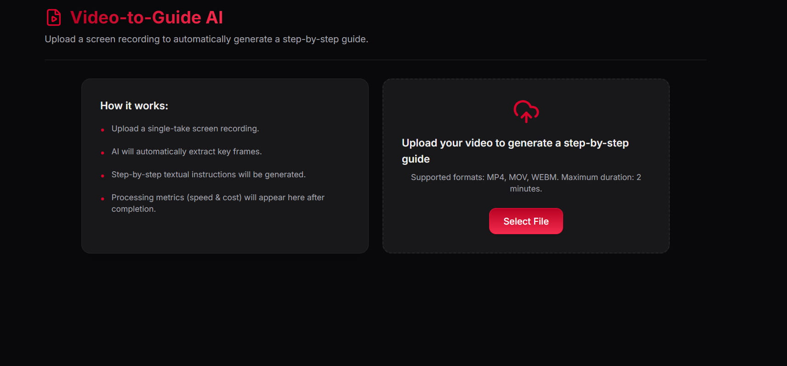
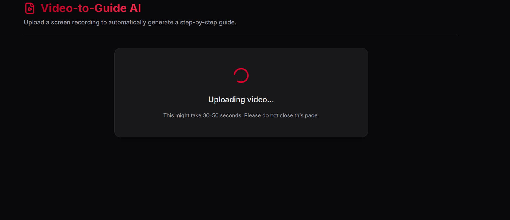
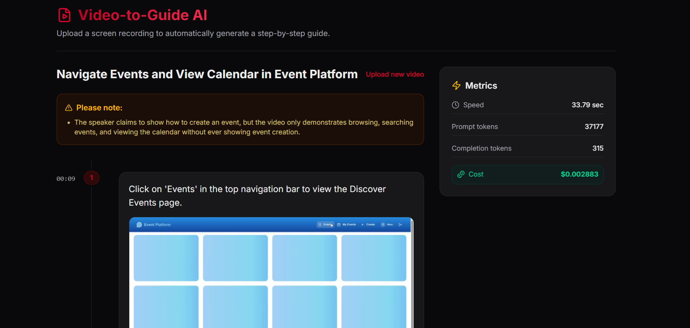
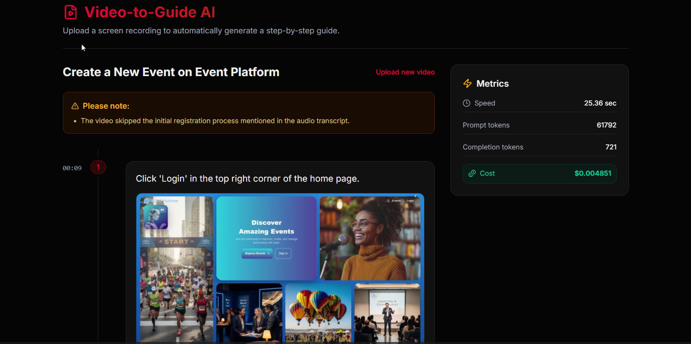
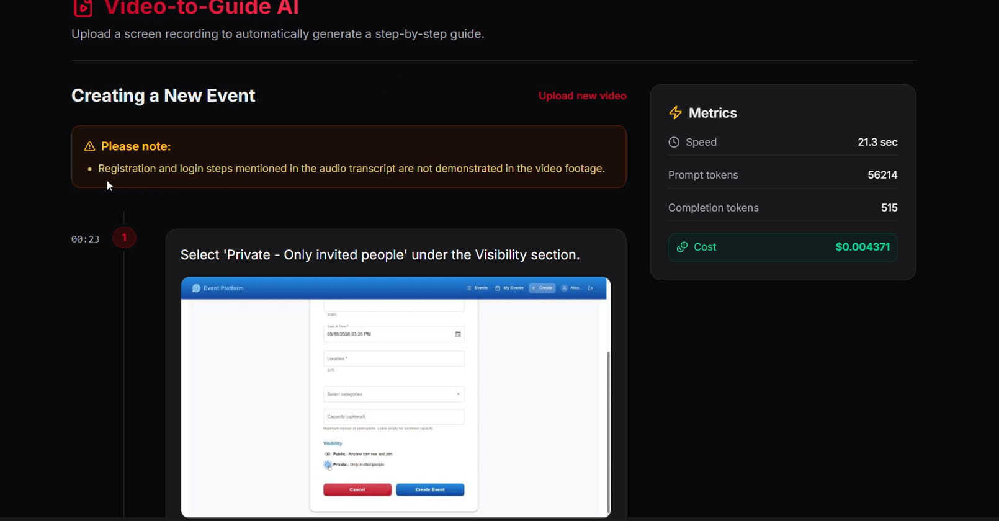

# AI Video Guide

AI Video Guide is an intelligent web application designed to automatically generate step-by-step instructional guides from video demonstrations. It analyzes uploaded videos, extracts key frames and audio transcripts, and leverages advanced AI (Google Gemini / Mistral Pixtral) to create clear, concise, and visual "How-To" instructions.

## *screenshots*

  
  
  
  
  
  
  
  

###  Edge-Case & Resilience Testing

_**Note:** This application runs on free-tier hosting and AI models. To avoid server overloads or API limits, the optimal time for testing is during off-peak hours (weekends or after midnight). Testing during peak hours may result in temporary unavailability and require multiple attempts._

## Demo & Results

To ensure the AI is robust and handles real-world usage gracefully, the system was stress-tested against various non-standard scenarios:

* **Intentionally Skipped Steps:** Tested how the AI bridges logical gaps and maintains the flow of the guide when the user rushes through the process.
* **Incorrect Actions & Mistakes:** Verified that the AI can filter out user mistakes (e.g., clicking the wrong button and correcting it) without confusing the final documentation.
* **"Silent" or Subtle Clicks:** Ensured the AI successfully detects fast, unpronounced, or visually subtle actions on the screen.
* **Irrelevant/Erroneous Videos:** Fed the system random videos completely unrelated to tutorials to test error handling, validation, and appropriate AI fallback responses.

  _Check out the test run below:_

###  Test Video-1 (Input)
Here is the original screen recording used for testing:
 [Watch the Test Video](https://drive.google.com/file/d/1k2Lbp9zOI4mBz3u7kfxHluPuPAo_gcl2/view?usp=sharing)

### Test Result-1 (Generated Guide)
And here is the clean, step-by-step professional guide automatically generated by the AI from the video above:
 [View the Test Result](https://drive.google.com/file/d/1I9A3q3eCa7RokeLA4a1QV4gINvF-s5Ed/view?usp=sharing)

###  Test Video-2 (Input)
Here is the original screen recording used for testing:
 [Watch the Test Video](https://drive.google.com/file/d/1I9A3q3eCa7RokeLA4a1QV4gINvF-s5Ed/view?usp=sharing)

### Test Result-2 (Generated Guide)
And here is the clean, step-by-step professional guide automatically generated by the AI from the video above:
 [View the Test Result](https://drive.google.com/file/d/1I86yMsDWyfZNH7Doqotvd14gqFfmKyPf/view?usp=sharing)

###  Test Video-3 (Input)
Here is the original screen recording used for testing:
 [Watch the Test Video](https://drive.google.com/file/d/1K1ZRORBVgisYPYau7QP4HdH8xeA_suwR/view?usp=sharing)

### Test Result-3 (Generated Guide)
And here is the clean, step-by-step professional guide automatically generated by the AI from the video above:
 [View the Test Result](https://drive.google.com/file/d/11J2LGSSQJQPT8owzkURfid6Yvb_llu_V/view?usp=sharing)

##  Features

- **Automated Video Analysis**: Extracts frames and transcribes audio (using Groq Whisper) to understand the context.
- **AI-Powered Generation**: Generates structured, step-by-step guides using Google Gemini (with an OpenRouter fallback).
- **Modern User Interface**: A responsive and visually appealing frontend built with Next.js 16 and Tailwind CSS.
- **Detailed Metrics**: Provides insights into processing time, token usage, and estimated AI costs.

##  Project Structure

This is a monorepo consisting of two main parts:

- `apps/backend`: Python, FastAPI application responsible for video processing, audio transcription, and AI integration.
- `apps/frontend`: Next.js frontend application providing the user interface for video uploads and timeline visualization.

## Tech Stack

**Frontend:**
- [Next.js](https://nextjs.org/) (React framework)
- [Tailwind CSS](https://tailwindcss.com/) (Styling)
- [Lucide React](https://lucide.dev/) (Icons)

**Backend:**
- [FastAPI](https://fastapi.tiangolo.com/) (Web framework)
- [OpenCV](https://opencv.org/) (Video frame extraction)
- Google GenAI SDK & Groq API (AI Inference and Transcription)

##  Documentation

For detailed technical information, architecture, and setup instructions, please refer to the [DOCUMENTATION.md](./DOCUMENTATION.md).

##  Getting Started

### Prerequisites
- Node.js (v18+)
- Python 3.10+
- FFmpeg (required for backend audio extraction)

### Backend Setup
1. Navigate to the backend directory: `cd apps/backend`
2. Create a virtual environment: `python -m venv .venv`
3. Activate the environment:
   - Windows: `.venv\Scripts\activate`
   - Mac/Linux: `source .venv/bin/activate`
4. Install dependencies: `pip install -r requirements.txt`
5. Configure `.env` based on `.env.example`.
6. Run the server: `fastapi dev main.py`

### Frontend Setup
1. Navigate to the frontend directory: `cd apps/frontend`
2. Install dependencies: `npm install`
3. Run the development server: `npm run dev`

Open [http://localhost:3000](http://localhost:3000) to view the application in your browser.
